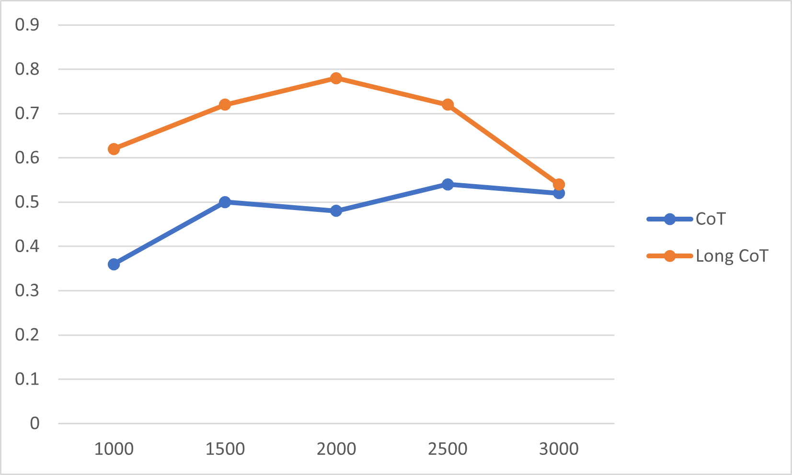

# Long-CoT-data-for-LLM-to-solve-24-puzzle

It is a dataset for fine-tuning LLM to solve 24(puzzle)

The code is modified from https://github.com/StephenA0/Challenge-24
# CoT dataset
run `24puzzle_cot.py` to get the CoT dataset.
There is an example:

> Given the numbers 3, 7, 4, 5, I should calculate step by step to get 24.
> 
> Step 1: The most reseaonable operation is (3 - 7),  which leaves 4, 5 as the remaining numbers.
> 
> Step 2: The most reseaonable operation is ((3 - 7) * 5),  which leaves 4 as the remaining numbers.
> 
> Step 3: The last operation should be (4 - ((3 - 7) * 5)).

# Long CoT dataset （CoT with Reflection)
run `24puzzle_longcot.py` to get the Long CoT dataset as follows

> Given the numbers 3, 7, 4, 5, I should calculate step by step to get 24.
> 
> Step 1: The most reseaonable operation is (3 - 7),  which leaves 4, 5 as the remaining numbers.
> 
> Step 2: The most reseaonable operation is ((3 - 7) + 5),  which leaves 4 as the remaining numbers.
> 
> Fianl Step: The last operation should be (((3 - 7) + 5) + 4).
> 
> It is wrong, let's get back to the previous step2 and try another operation.
> 
> New Step 2: The most reseaonable operation is ((3 - 7) * 5),  which leaves 4 as the remaining numbers.
> 
> New Final Step: The last operation should be (4 - ((3 - 7) * 5)).

# Use it to train a LLM
I use [LLaMa-factory](https://github.com/hiyouga/LLaMA-Factory) to train Qwen-2.5-0.5b-instruct to demonstrate it, which is trained on my laptop.
Training dataset size is 40,000, and batch size is 8 with LoRa. I set the learning rate to 1e-5.

The test prompt is like

> Given the numbers 3, 7, 4, 5. Use numbers and basic arithmetic operations (+ - * /) to obtain24.

I use gpt-4o to determine if thr result is correct. The size of test dataset is 50. The evalation prompt is

> Is the inference pipline right and the fianl-step calculation result 24? Please respond "Yes" or "No" only.

Model	| Method	| Acc (best step)
---|---|---
Qwen2.5-0.5	| w/o finetune	| 0% (-)
Qwen2.5-0.5	| SFT with CoT data	| 54% (2500)
Qwen2.5-0.5	| SFT with Long CoT data	| 78% (2000)

### the accuracy on test dataset
 

